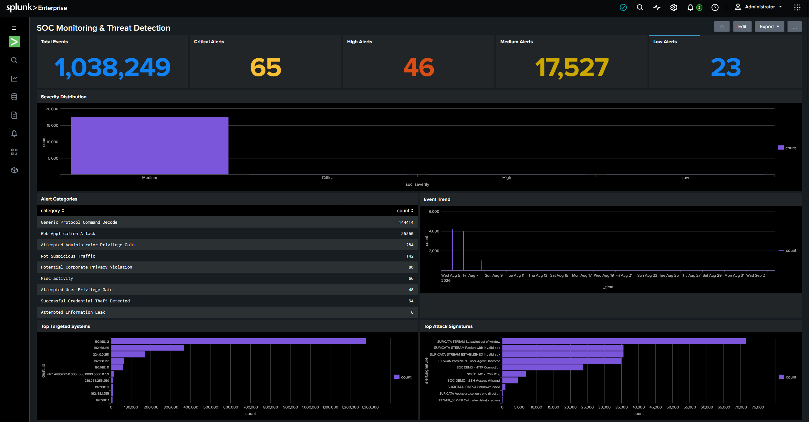
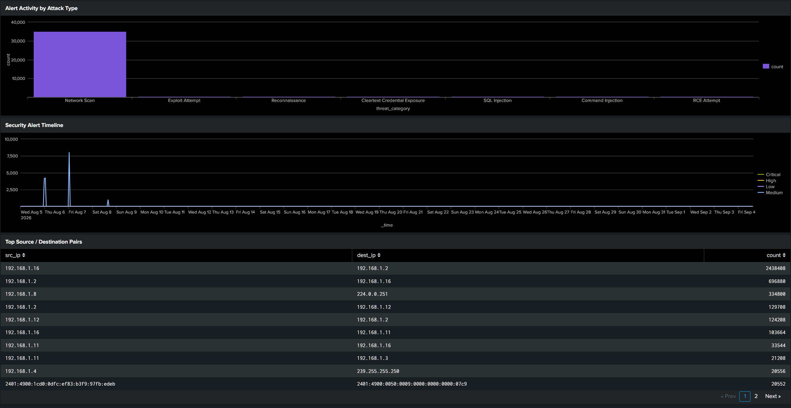
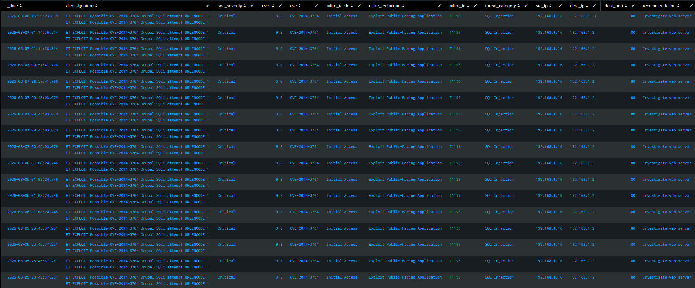
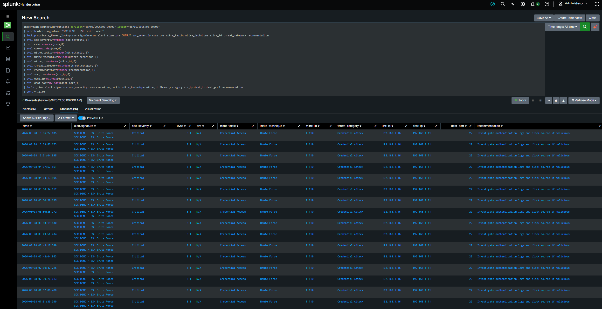
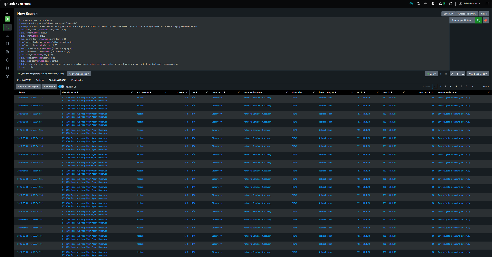

# SOC Monitoring & Threat Detection Lab

<p align="center">
  <strong>Suricata + Splunk SOC L1 Home Lab</strong><br>
  Network Detection • SIEM Monitoring • Alert Triage • Threat Enrichment • MITRE ATT&CK
</p>

<p align="center">
  
  
  
  
</p>

A hands-on SOC L1 home lab demonstrating network threat detection, SIEM monitoring, alert triage, log investigation, threat enrichment, MITRE ATT&CK mapping, and security dashboard development.

> **Environment:** Controlled virtual lab for defensive security training and SOC analyst practice.

---

## What I Built

I built a controlled SOC monitoring workflow around **Suricata IDS** and **Splunk SIEM**.

```text
Controlled Lab Traffic
        ↓
    Suricata IDS
        ↓
   EVE JSON Logs
        ↓
 Splunk Universal Forwarder
        ↓
  Splunk Enterprise
        ↓
 SPL Investigation + Enrichment
        ↓
 SOC Dashboard
        ↓
 L1 Triage / MITRE ATT&CK / Recommendation
```

The project demonstrates the practical analyst workflow:

**Detect → Validate → Investigate → Classify → Enrich → Map → Recommend → Document**

---

## Key Capabilities

- Configured Suricata for controlled network threat detection
- Generated and validated security events in a virtual lab
- Forwarded Suricata EVE JSON telemetry into Splunk
- Built reusable SPL searches for SOC investigation
- Enriched Suricata signatures using a threat lookup
- Added SOC severity, CVSS, CVE, MITRE ATT&CK, threat category, and recommendations
- Built a Splunk SOC monitoring dashboard
- Investigated source/destination IPs, ports, protocols, signatures, and timestamps
- Performed L1 alert triage and documented investigation decisions
- Used Nmap, Wireshark, and tcpdump for controlled network analysis and validation

---

## Detection Coverage

The lab includes controlled detection and investigation scenarios for:

| Scenario | Purpose |
|---|---|
| ICMP Ping Activity | Validate basic network-event detection |
| HTTP Traffic | Validate HTTP telemetry and web traffic visibility |
| SSH Access Attempt | Detect inbound SSH connection attempts |
| SSH Brute Force | Detect repeated SSH connection attempts from a source |
| Nmap / Network Scanning | Analyze reconnaissance and scanning activity |
| Vulnerability / Exploit Attempts | Investigate vulnerability-related Suricata signatures |

Custom Suricata rules are maintained in:

```text
detection-rules/suricata/soc_demo.rules
```

---

## Splunk SIEM Investigation

Primary search scope:

```spl
index=main sourcetype=suricata
```

Key telemetry fields include:

- `src_ip`
- `dest_ip`
- `src_port`
- `dest_port`
- `proto`
- `alert.signature`
- `alert.severity`
- `alert.category`
- `_time`

The repository contains reusable SPL for:

- Event volume and trends
- Severity distribution
- Top source and destination systems
- Top signatures
- Port and protocol analysis
- Source/destination correlation
- Critical and High alert investigation
- Signature-specific investigations
- Lookup-based enrichment

See [`splunk/searches.md`](splunk/searches.md).

---

## Threat Enrichment

Selected Suricata signatures are enriched using `suricata_threat_lookup.csv` with:

| Enrichment | Purpose |
|---|---|
| SOC Severity | L1 prioritization |
| CVSS | Vulnerability severity context |
| CVE | Vulnerability identification |
| MITRE Tactic | Adversary-behavior context |
| MITRE Technique | Behavioral classification |
| Threat Category | Investigation grouping |
| Recommendation | Suggested analyst action |

The enrichment is used to prioritize and contextualize alerts; it is not treated as proof that exploitation succeeded.

---

## Example Investigations

The project contains investigation evidence for scenarios including:

- **Drupal SQL Injection — CVE-2014-3704**
- **Cisco ASA / Firepower Path Traversal — CVE-2020-3452**
- **Nmap Network Scanning**
- **SSH Brute Force**

For each investigation, the analyst reviews the detection signature, timestamp, source, destination, port, severity, enrichment, and recommended next action.

### Investigation Workflow

```text
Alert Intake
    ↓
Validate Timestamp / Host
    ↓
Review Source + Destination
    ↓
Analyze Ports / Protocol
    ↓
Enrich Signature
    ↓
Assess Severity
    ↓
Correlate Related Activity
    ↓
MITRE ATT&CK Context
    ↓
Document Findings
    ↓
Escalate When Required
```

> **Important:** A Suricata detection indicates that network traffic matched a detection condition. It does **not** independently prove successful exploitation or system compromise.

---

## SOC Dashboard

The **SOC Monitoring & Threat Detection** dashboard provides a centralized monitoring and investigation view.

### Dashboard coverage

- Total security events
- Critical / High / Medium / Low alert counts
- Severity distribution
- Alert and threat categories
- Event trends
- Security alert timeline
- Top source IPs
- Top targeted systems
- Top destination ports
- Protocol distribution
- Source/destination activity
- Top attack signatures
- Latest enriched security alerts
- Critical investigation table
- High/Critical investigation table

Dashboard documentation and SPL are available in [`splunk/dashboard.md`](splunk/dashboard.md).

---

## Screenshots

### SOC Dashboard



### Dashboard Investigation View



### Critical Alert Investigation



### SSH Brute Force Investigation



### Network Scan Investigation



More investigation evidence is available in the [`screenshots/`](screenshots/) directory.

---

## Technologies & Tools

| Category | Tools |
|---|---|
| SIEM | Splunk Enterprise, Splunk Universal Forwarder |
| IDS / Detection | Suricata |
| Network Analysis | Wireshark, tcpdump |
| Network Scanning | Nmap |
| Operating Systems | Kali Linux, Ubuntu, Windows |
| Virtualization | VirtualBox |
| Threat Framework | MITRE ATT&CK |
| Query Language | Splunk SPL |
| Log Format | Suricata EVE JSON |

---

## Repository Structure

```text
SOC-Monitoring-Threat-Detection/
│
├── detection-rules/
│   └── suricata/
│       └── soc_demo.rules
│
├── documentation/
│   ├── alert-triage.md
│   ├── architecture.md
│   └── investigation-workflow.md
│
├── mitre/
│   └── attack-mapping.md
│
├── screenshots/
│   ├── critical-alert-investigation.png
│   ├── splunk-dashboard-overview.png
│   ├── splunk-dashboard-investigation.png
│   ├── network-scan-investigation.png
│   └── ssh-brute-force-investigation.png
│
├── splunk/
│   ├── dashboard.md
│   └── searches.md
│
├── .gitignore
└── README.md
```

---

## Skills Demonstrated

### SOC / Blue Team

- L1 alert triage
- Security event analysis
- Log investigation
- Detection engineering fundamentals
- Severity classification
- Threat enrichment
- MITRE ATT&CK mapping
- Security monitoring
- Analyst documentation

### SIEM

- Splunk data ingestion
- SPL searches
- Event filtering and aggregation
- Lookup-based enrichment
- CVSS/CVE context
- Dashboard development
- Alert investigation

### Network Security

- Suricata IDS
- Network traffic analysis
- TCP/IP and common protocols
- Port and service analysis
- Nmap scanning analysis
- Wireshark packet inspection
- tcpdump packet capture

### Linux / Lab Administration

- Kali Linux
- Ubuntu
- Linux command-line troubleshooting
- VirtualBox virtual lab administration

---

## Architecture

Detailed architecture documentation is available in [`documentation/architecture.md`](documentation/architecture.md).

The environment consists of controlled Kali/Ubuntu traffic, Suricata detection, EVE JSON telemetry, Splunk Universal Forwarder ingestion, Splunk Enterprise analysis, and dashboard-based SOC monitoring.

---

## Documentation

| Document | Description |
|---|---|
| [`documentation/architecture.md`](documentation/architecture.md) | Lab architecture and data flow |
| [`documentation/alert-triage.md`](documentation/alert-triage.md) | SOC L1 alert triage process and examples |
| [`documentation/investigation-workflow.md`](documentation/investigation-workflow.md) | Investigation methodology and escalation workflow |
| [`mitre/attack-mapping.md`](mitre/attack-mapping.md) | ATT&CK behavioral mapping |
| [`splunk/searches.md`](splunk/searches.md) | Reusable SPL investigation searches |
| [`splunk/dashboard.md`](splunk/dashboard.md) | Dashboard panels and configuration |

---

## Scope & Limitations

This is a **controlled defensive training environment**, not a production SOC deployment.

The project focuses on network detection and SIEM investigation. It does not claim to implement enterprise EDR, SOAR, ticketing, or full endpoint telemetry integrations.

The complete lab requires separately installed and configured instances of the listed tools.

All scanning and security testing must be performed only against systems and networks where explicit authorization exists.

---

## Future Enhancements

- Add sanitized sample logs
- Add additional Suricata detections
- Expand Windows endpoint telemetry
- Improve dashboard visualizations
- Add additional ATT&CK coverage
- Add a lightweight alert/ticket tracking workflow
- Add automated detection validation

---

## Author

**Akash Jose**  
Cybersecurity / SOC Analyst Portfolio Project  
GitHub: `joseakash2000-stack`

---

## Disclaimer

This project is created for **educational, defensive security, and SOC analyst portfolio purposes**. All testing should be performed only in systems and networks where the tester has explicit authorization to test.
